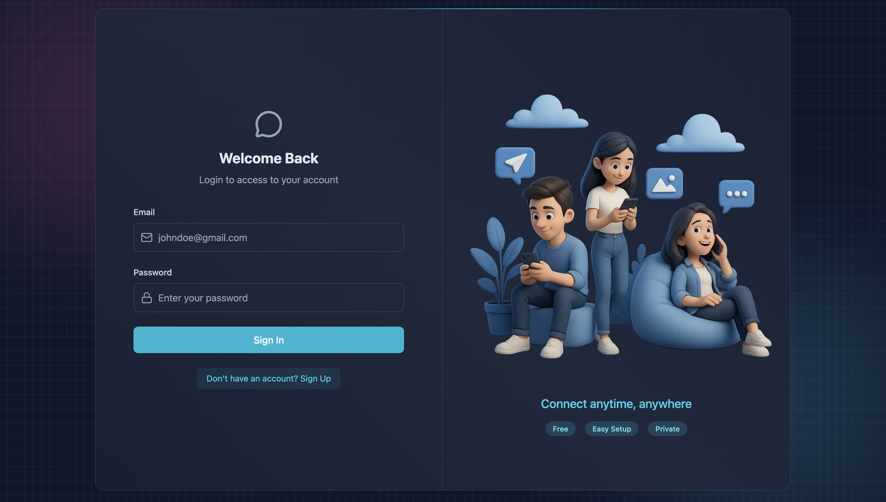
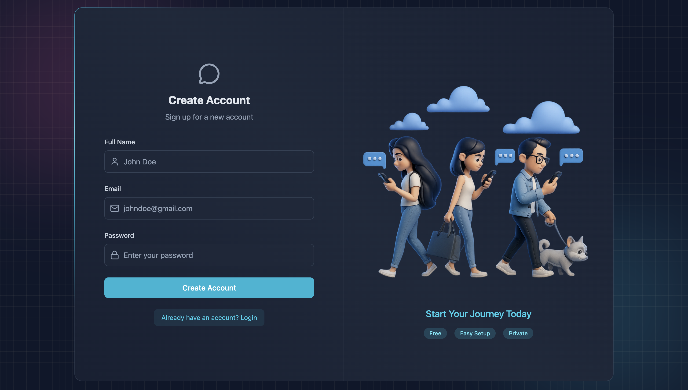
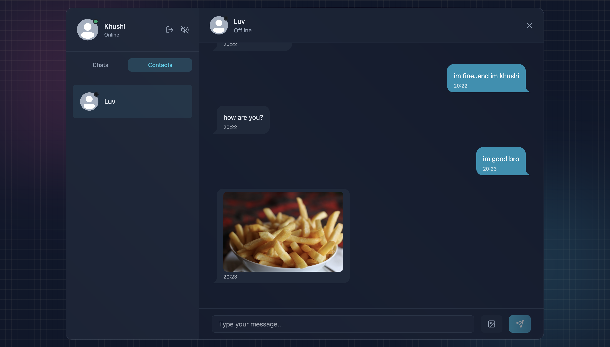

<h1 align="center">✨ ChatterBox ✨</h1>

# Full Stack Chat App

## 📦 Features

- 🔐 Custom JWT Authentication (no 3rd-party auth)
- ⚡ Real-time Messaging via Socket.io
- 🟢 Online/Offline Presence Indicators
- 🔔 Notification & Typing Sounds (with toggle)
- 📨 Welcome Emails on Signup (Resend)
- 🗂️ Image Uploads (Cloudinary)
- 🧰 REST API with Node.js & Express
- 🧱 MongoDB for Data Persistence
- 🚦 API Rate-Limiting powered by Arcjet
- 🎨 Beautiful UI with React, Tailwind CSS & DaisyUI
- 🧠 Zustand for State Management
- 🧑‍💻 Git & GitHub Workflow (branches, PRs, merges)
- 🚀 Easy Deployment (free-tier friendly with Render)

---


## 🖼️ Screenshots






## 🧪 .env Setup

### Backend (`/backend`)

```bash
PORT=3000
MONGO_URI=your_mongo_uri_here

NODE_ENV=development

JWT_SECRET=your_jwt_secret

RESEND_API_KEY=your_resend_api_key
EMAIL_FROM=your_email_from_address
EMAIL_FROM_NAME=your_email_from_name

CLIENT_URL=http://localhost:5173

CLOUDINARY_CLOUD_NAME=your_cloudinary_cloud_name
CLOUDINARY_API_KEY=your_cloudinary_api_key
CLOUDINARY_API_SECRET=your_cloudinary_api_secret

ARCJET_KEY=your_arcjet_key
ARCJET_ENV=development
```

---

## 🔧 Run the Backend

```bash
cd backend
npm install
npm run dev
```

## 💻 Run the Frontend

```bash
cd frontend
npm install
npm run dev
```

---

## 🌎 Deployment

**Live:** [mern-chatterbox-ob8h.onrender.com](https://mern-chatterbox-ob8h.onrender.com/)

You can also deploy using Render or similar services.  
Make sure to add/secure your environment variables on the host platform.

---

## 🧩 Tech Stack

- **Frontend:** React, TailwindCSS, DaisyUI, Zustand
- **Backend:** Node.js, Express
- **Database:** MongoDB
- **Cloud Features:** Cloudinary (Images), Resend (Emails)
- **Socket.io:** Real-time chat
- **Arcjet:** Rate limiting

---

## 📝 Contribution

Fork, branch, push changes, and create a PR.  
All contributions are welcome!


